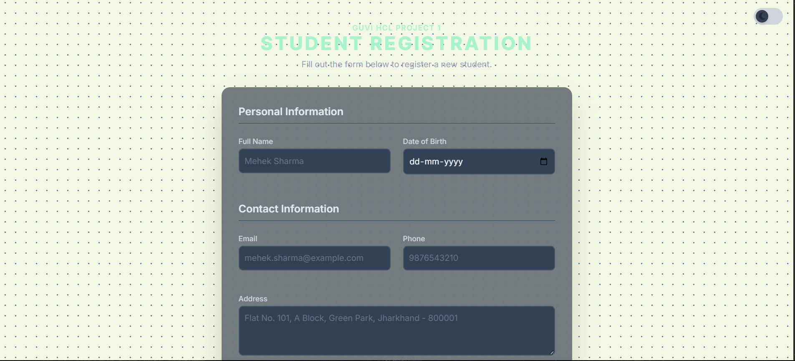
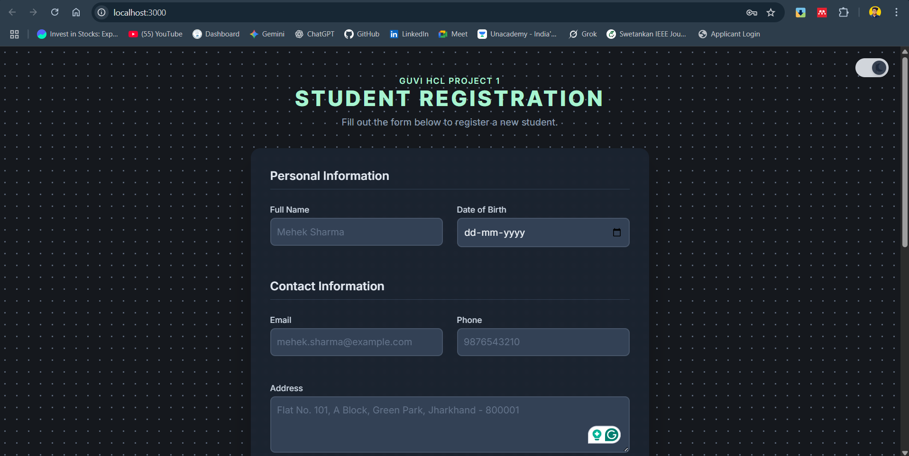
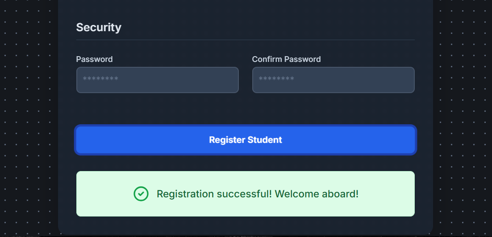

# 🎓 Digital Student Registration System

A web-based student registration system built with **Node.js, Express, MySQL, and Tailwind CSS**. This application allows users to register students by filling out a form with personal and academic details, which are then stored securely in a MySQL database.

---

## 📌 Features

-   **Fully Responsive Design**: A clean user interface that works on all device sizes.
-   **Light/Dark Mode**: A theme toggle for user preference, styled with Tailwind CSS.
-   **Dynamic Registration Form**: An intuitive form for capturing student details.
-   **Client-Side Validation**: Real-time form validation using JavaScript to ensure data integrity.
-   **RESTful API**: A robust backend API built with Node.js and Express.js.
-   **Secure Database**: Securely stores all registration data in a MySQL database.

---

## 🛠️ Tech Stack

-   **Frontend**: HTML5, Tailwind CSS, JavaScript
-   **Backend**: Node.js, Express.js
-   **Database**: MySQL

---

## 🖼️ Screenshots

*(Replace the placeholder links below with actual screenshots of your project.)*

| Light Mode                                      | Dark Mode                                     |
| ----------------------------------------------- | --------------------------------------------- |
|  |  |

**Successful Submission:**


---

## ⚙️ Getting Started

Follow these instructions to get a copy of the project up and running on your local machine for development and testing purposes.

### Prerequisites

Make sure you have the following software installed on your machine:
-   [Node.js](https://nodejs.org/) (which includes npm)
-   [MySQL](https://www.mysql.com/downloads/)

### Installation & Setup

1.  **Clone the Repository**
    ```bash
    git clone [https://github.com/Swetankan/GUVI-Project.git](https://github.com/Swetankan/GUVI-Project.git)
    cd GUVI-Project
    ```

2.  **Install Dependencies**
    Install the required npm packages.
    ```bash
    npm install
    ```

3.  **Configure the MySQL Database**
    a. Open your MySQL client and run the following commands to create the database and table.
    ```sql
    CREATE DATABASE student_registration;

    USE student_registration;

    CREATE TABLE students (
        id INT AUTO_INCREMENT PRIMARY KEY,
        fullName VARCHAR(255) NOT NULL,
        dob DATE NOT NULL,
        email VARCHAR(255) UNIQUE NOT NULL,
        phone VARCHAR(20) NOT NULL,
        address TEXT,
        course VARCHAR(100) NOT NULL,
        password VARCHAR(255) NOT NULL
    );
    ```

    b. Update your database credentials in `server.js`.
    ```javascript
    // Find this block in server.js and update it
    const db = mysql.createConnection({
      host: 'localhost',
      user: 'root',
      password: 'your_mysql_password', // 👈 Change this to your MySQL password
      database: 'student_registration'
    });
    ```

4.  **Run the Server**
    Start the application server.
    ```bash
    node server.js
    ```

5.  **View the Application**
    Open your web browser and navigate to: `http://localhost:3000`

---

## 🗂️ Project Structure

```
GUVI-Project/student-registration/
├── public/
│   └── index.html         # Main HTML file with embedded CSS and JS
├── .gitignore
├── package.json
├── package-lock.json
├── screenshots/
│    └── light-mode-image.png
│    └── dark-mode-image.png
│    └── success-image.png
├── server.js              # Express server and API logic
└── README.md
└── website.pdf
```

---

## 📄 License

This project is licensed under the **MIT License**.

---

## 👨‍💻 Author

**Swetankan Kumar Sinha**

-   **GitHub**: [@Swetankan](https://github.com/Swetankan)
-   **Email**: `swetankan23.sinha@gmail.com`
-   **Project Repository**: [https://github.com/Swetankan/GUVI-Project/](https://github.com/Swetankan/GUVI-Project/)

---

> **Note:** This is a student academic project developed as part of the GUVI Full Stack Development program. The application is intended for educational and demonstration purposes only.
